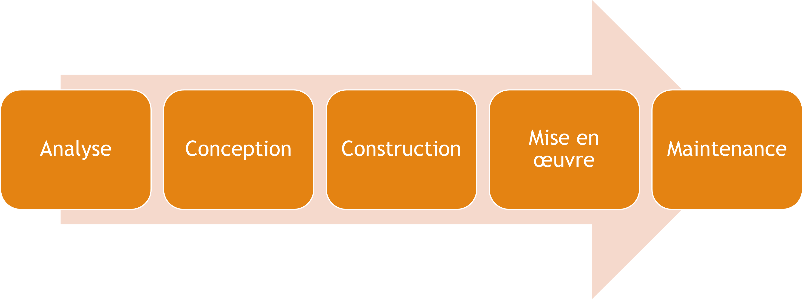

# Introduction aux bases de données relationnelles

## Pourquoi utiliser des bases de données?

* Organiser de larges quantités de données
* Sélectionner rapidement des informations dans de grands ensembles de données 
* Stocker de façon persistante des informations
  
*Abréviation* : **BD** = Base de données / **DB** = *Database*

## Architecture des bases de données

__Modèle client-serveur__

La base de données est hébergée sur un **serveur** auquel l'utilisateur (appelé client) se connecte pour effectuer des manipulations. Ce *client* peut être un *logiciel client* natif ou une application web.

## Systèmes de gestion de base de données

Les systèmes de gestion de base de données (SGBD) sont des logiciels spécialisés en gestion de données.

- MySQL (libre — SQL — relationnelle)
- Microsoft SQL Server (propriétaire - SQL - relationelle)
- MongoDB (libre — No SQL)
- SQLite (libre — SQL — relationnelle/embarquée)
- PostgreSQL (libre — SQL — relationnelle)
- Oracle (propriétaire — SQL — relationnelle)

## Pourquoi utiliser un SGBD plutôt qu'un système de fichier local?

Les SGBD offrent :

* Une gestion limitant les redondances de données
* Une meilleure organisation de l'information
* Règles d'intégrité (validation des données)
* Contrôle de la concurrence (explications: <https://www.geeksforgeeks.org/concurrency-control-in-dbms/>)
* Fiabilité/Récupération des données/Journalisation
* Indépendance du stockage des données par rapport à l'application

## Processus de développement d'une BD

Dans le cours BD1, nous nous intéresserons principalement à l'étape de construction.

## Interagir avec une BD

Afin d'interagir avec une BD on a besoin minimalement de deux langages :

- Un langage de définition des données (LDD) permettant entre autres de créer et modifier les tables et leur structure.
- Un langage de manipulation des données (LMD) permettant entre autres d'ajouter, modifier ou supprimer des lignes dans des tables.

En surplus on peut utiliser un langage de contrôle de transaction, un de contrôle des données, un de gestion des accès et plusieurs autres...

Heureusement, le langage de programmation _Structured Query Language_ (Langage de requêtes structurées) abrégé par **SQL** regroupe **tous ces besoins**.

Le langage SQL (prononcé parfois "SEE-QWEL" par les anglophones) permet de créer et manipuler des BD ainsi que de gérer certains aspects relatifs aux transactions et aux autorisations.

## Origine du langage

La toute première version du langage SQL a été développée chez IBM en 1970. En 1979, la compagnie Oracle présenta une version commercialement disponible au grand public. SQL fut rapidement imité et adopté par d'autres fournisseurs.

La plupart des langages de programmation impératifs que vous avez vu (C#, PHP, javascript ...) sont basés sur la théorie de l'algorithmie. Mais SQL provient de la théorie des ensembles. C'est un langage DÉCLARATIF qui permet de décrire le résultat escompté, *sans décrire la manière de l'obtenir*. Les SGBD (systèmes de gestion de bases de données) tel que SQL sont équipés d'optimiseurs de requêtes - des mécanismes qui déterminent automatiquement la manière optimale d'effectuer les opérations, notamment par une estimation de la complexité algorithmique. (Source: <https://fr.wikipedia.org/wiki/Structured_Query_Language>)