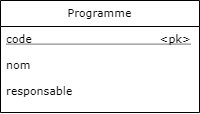
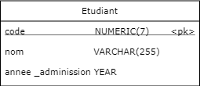
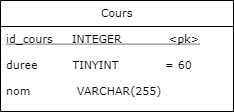
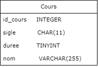
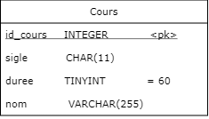

# Création de BD et de tables

## Normes de code du langage SQL

- Mots-clés du langage en MAJUSCULE (ex.: CREATE, SELECT, etc)
- Identifiants en minuscules (notation _, pas de CamelCase)
- Nom de tables et de BD commencent par une MAJUSCULE
- Commentaires multi-lignes: /* … */
- Commentaire jusqu'à la fin de la ligne: #
- On termine une requête par un ;
- Apostrophes simples ' ' pour délimiter les caractères littéraux (string)

Les guillemets " " fonctionnent seulement dans certains cas, les apostrophes simples ' ' fonctionnent dans tous les cas.

## Créer une BD

Pour créer une base de données l'instruction est :

```mysql
CREATE DATABASE Nom_bd;
```

Pour afficher la liste des bases de données sur un serveur, on utilise la commande:

```mysql
SHOW DATABASES;
```

## Supprimer une BD

Pour supprimer une base de données, l'instruction est : 

```mysql
DROP DATABASE Nom_bd;
```

Toutes les tables et les enregistrements sont automatiquement supprimés. 

__Attention! Aucune confirmation n'est demandée.__

## :material-cog: --- Exercice 1.4.1 ---

1. Créer une base de données nommée « Exemples »
2. Lister les bases de données
3. Supprimer la base de données « Exemples »
4. Lister les bases de données pour confirmer
5. Créer de nouveau une base de données « Exemples »

Quel raccourcis clavier permet d'exécuter toutes les lignes ou la ligne courante?

## Créer une table

Pour créer une table, il faut d'abord sélectionner une BD. La sélection se fait à l'aide l'instruction suivante :

```mysql
USE Nom_bd;
```

:exclamation:La BD sera celle utilisée pour toutes les requêtes tant que l'instruction **USE** n'aura pas été rappelée.

Pour créer une table, la syntaxe est la suivante:

```mysql
CREATE TABLE Nom_table (
    nom_colonne1 TYPE, 
    nom_colonne2 TYPE, 
    ...);
```

**Exemple – Créer une table**

Pour créer la table Étudiant correspondant au modèle suivant.


```mysql
CREATE TABLE Etudiant (
    code INTEGER, 
    nom VARCHAR(255), 
    annee_admission YEAR);
```

## Afficher les tables

Pour afficher toutes les tables de la BD active, on utilise l'instruction :

```mysql
SHOW TABLES;
```

Pour afficher la structure d'une table, on utilise l'instruction :

```mysql
DESCRIBE Nom_table;
```

## :material-cog: --- Exercice 1.4.2 ---

Créez la table représentant le modèle suivant.



Afficher la structure de la table après la création pour vous valider votre opération.

## Notation diagrammes ER

On note sur le modèle de base de données le type de données associé au champ.

Par exemple, pour la table Étudiant, le modèle correspond maintenant à 



## Supprimer une table

Pour supprimer une table, l'instruction à utiliser est :

```mysql
DROP TABLE Nom_table;
```

Tous les enregistrements sont automatiquement supprimés.

__Attention! Aucune confirmation n'est demandée.__

## Clé primaire

Pour indiquer qu'un champ est une clé primaire, on indique __PRIMARY KEY__ après le type du champ.

```mysql
CREATE TABLE Etudiant (
    code INTEGER PRIMARY KEY, 
    nom VARCHAR(255), 
    adresse VARCHAR(255));
```

## Auto-incrément

Dans le cas où l'on ajoute un identifiant unique (id), on peut indiquer au SGBD d'incrémenter automatiquement sa valeur à chaque enregistrement. 

Cela nous évite de devoir manuellement gérer la mise à jour de l'identifiant.

Cette fonction est disponible que si le type de colonne est INTEGER.

## :material-cog: --- Exercice 1.4.3 ---

Pour définir un auto-incrément, il faut indiquer __AUTO_INCREMENT__ après le type de la colonne.

Créer la table Cours. La colonne id_cours doit être auto-incrémentée. Afficher la table après pour voir l'impact de l'incrémentation automatique.

## Valeurs par défaut

À la création d'une table, on peut indiquer une valeur par défaut.

Tous les nouveaux enregistrements auront cette valeur pour la colonne sauf si une autre valeur est indiquée.

On indique une valeur par défaut en utilisant la syntaxe suivante :

```mysql
nom_colonne TYPE DEFAULT valeur
```

Pour ajouter une valeur par défaut sur un diagramme ER on l'indique avec le symbole = après le type.

Par exemple, dans la table Cours la durée par défaut est de 60 heures.



La requête pour créer la table cours serait donc:

```mysql
CREATE TABLE Cours (  
    id INTEGER PRIMARY KEY AUTO_INCREMENT,  
    sigle CHAR(11), 
    duree TINYINT DEFAULT 60,  
    nom VARCHAR(255));
```

## Modifier une table

Pour modifier une table, trois opérations sont possibles : ajouter une colonne, modifier une colonne, supprimer une colonne.

La requête est:

```mysql
ALTER TABLE Nom_de_la_table 
    opération1, 
    opération2 ... ;
```


### Ajouter une colonne

L'instruction est ADD suivi de la définition de la colonne

Par exemple, on a oublié une colonne dans la table Cours (on veut le résultat de droite)


La requête pour corriger la table est:

```mysql
ALTER TABLE Cours
    ADD sigle CHAR(11);
```

### Modifier une colonne

Pour modifier une colonne existante, on utilise l'instruction MODIFY COLUMN suivie de la nouvelle définition de la colonne.

On a créé la table Cours avec la requête suivante:

```mysql
CREATE TABLE Cours (  
    id INTEGER, 
    sigle CHAR (11),  
    duree SMALLINT, 
    nom VARCHAR(255));
```




La requête de modification devrait être:

```mysql
ALTER TABLE Cours   
    MODIFY COLUMN id INTEGER PRIMARY KEY AUTO_INCREMENT,   
    MODIFY COLUMN duree SMALLINT DEFAULT 60;
```
  


### Supprimer une colonne

On utilise l'instruction:

```mysql
DROP COLUMN nom_colonne
```

Pour supprimer la colonne sigle de la table Cours, on utilise la requête suivante :

```mysql
ALTER TABLE Cours 
    DROP COLUMN sigle;
```