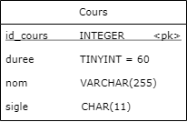
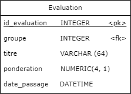

# Opérateurs arithmétiques et chaînes de caractères

## Opérations arithmétiques

On peut effectuer des opérations arithmétiques lors des requêtes.

|Opérateur|Symbole|
||:-:|
|Addition|+|
|Soustraction|-|
|Multiplication|*|
|Division|/|
|Modulo|%|

On veut sélectionner le nombre d’heures par semaine de chaque cours, sachant qu'une session dure 15 semaines.

```mysql
SELECT duree / 15 FROM Cours;
```

On peut utiliser des noms de colonne des deux côtés de l'opérateur.



## Recherche sur les chaînes de caractères

Pour rechercher simplement sur des chaînes de caractères (CHAR, VARCHAR) on utilise l’opérateur LIKE et les *patterns de recherche*.

Les patterns disposes de 3 caractères spéciaux :

- **%** : correspond à 0, 1 ou plusieurs caractères
- **_** : correspond à 1 unique caractère
- **\\** : permet d’échapper les caractères % ou _

Rechercher sur un objet TEXT risque de prendre énormément de temps. C'est le type d'opération qu'on évite à moins d'y être contraint.

Rechercher tous les mots qui commencent par *des*:

* Pattern : des%

Rechercher des mots de 2 lettres terminant par e:

* Pattern : _e

Rechercher des mots terminant par le symbole %:

* Pattern : %\\%

### Exemple LIKE

On veut sélectionner les pondérations et le titre de toutes les évaluation comportant le mot « final » ou « finale »

```mysql
SELECT ponderation, titre FROM Evaluation 
  WHERE titre LIKE '%final%';
```

On peut utiliser des noms de colonne des deux côtés de l'opérateur.



## Expressions régulières (Regex)

Les patterns sont simples à utiliser, mais aussi limités. Pour faire une recherche plus avancée, on utilise les REGEX (*Regular Expression*).

Notez que l'utilisation des Regex peut devenir rapidement complexe. Pour vous aider à vous former, utilisez le site <https://regexone.com/>.

Pour introduire une REGEX en MySQL, on utilise la syntaxe suivante :

```mysql
SELECT colonne FROM Table WHERE colonne RLIKE 'regex';
```

### Rechercher un caractère

À moins qu'il s'agisse d'un caractère spécial, indiquez une lettre dans une REGEX permet de chercher celle-ci, n'importe où dans la chaîne.

|Chaîne|Regex|Trouvé|
||||
|abc|a|Oui|
|cba|a|Oui|
|abc|ab|Oui|
|cba|ab|Non|
|cba|ba|Oui|
|abc|d|Non|

### Début et fin

Pour indiquer le début d'une chaîne, on utilise le symbole **^**, et pour la fin, le symbole **$**.

|Chaîne|Regex|Trouvé|
||||
|abc|^a|Oui|
|cba|a$|Oui|
|abc|^bc|Non|
|abc|^ab$|Non|
|abc|ab$|Non|

### Répétitions 

Les REGEX offrent 3 différents caractères spéciaux pour la répétition :
* **\*** : indique que le caractère peut s'y trouver 0, 1 ou plusieurs fois
* **?** : indique que le caractère peut s'y trouver 0 ou 1 fois
* **+** : indique que le caractère doit s'y trouver au moins une fois (1 ou plusieurs)

|Chaîne|Regex|Trouvé|
||||
|abc|a*|Oui|
|cba|a+|Oui|
|abc|b*c|Oui|
|aac|b*c|Oui|
|aac|a?c|Non|

|Chaîne|Regex|Trouvé|
||||
|aac|a+c|Oui|
|bbc|a+c|Non|
|aaaaaaaaaaaa|a*|Oui|
|aaaaaaaaaaaa|a?|Non|
|aaaaaaaaaaaa|a+|Oui|

### :material-cog: --- Exercice 2.3.1 ---

Écrivez les REGEX pour trouver les informations suivantes parmis les mots suivants :

chat

chaton

chatte

carotte

chalet

valet

animal

Utilisez le site <https://regex101.com/> pour vous aider.

A. Les mots contenant « chat » (3 mots)
B. Les mots commençant par « ch » (4 mots)
C. Les mots contenant un ou deux 2 « t » (6 mots)
D. Les mots finissant par « et » ou « e » (4 mots)
E. Les mots contenant « a » suivis de 1 ou plusieurs « t » (3 mots)

### Répétitions (suite)

On peut aussi spécifier le nombre exacte de répétition recherché ou les mettre dans un intervalle. On utilise la notation **{min, max}** ou **{nombre}**. On peut omettre le max si l'on cherche au moins *x* caractères et omettre le min si l'on cherche au plus *x* caractères

|Intervalle|Signification|
|:-:||
|{1, 3}|Entre 1 et 3 répétitions|
|{4}|Exactement 4 répétitions|
|{5,}|5 répétitions et plus|
|{,2}|Pas plus de 2 répétitions (équivalent à {0, 2})|
|{3,1}|Provoque une erreur|

### Classes de caractères

On peut sélectionner tous les caractères compris entre deux caractères (au sens du code ASCII), dans un ordre quelconque avec les classes de caractères. 

On indique une classe avec **[*min*-*max*]**. On peut juxtaposé des intervalles pour augmenter la portée de la classe.

|Classe|Signification|
|:-:||
|[a-z]|N'importe quelle lettre minuscule|
|[02468]|N'importe quel nombre pair|
|[a-zA-Z]|N'importe quelle lettre majuscule ou minuscule|
|[a-z-]|N'importe quelle lettre minuscule et le trait d'union (toujours à la fin !)|
|[a-zA-Z0-9]|N'importe quelle lettre ou nombre

|Énoncé|REGEX|
|||
|Un numéro de téléphone|[0-9]{3}-[0-9]{3}-[0-9]{4}|
|Une séquence contenant entre 3 et 8 lettres|[a-zA-Z]{3,8}|
|Un mot de 6 lettres commençant par h|^h[a-z]{5}$|

### :material-cog: --- Exercice 2.3.2 ---

Écrivez les REGEX pour trouver les informations suivantes parmis les mots suivants :
chat, chaton, chatte, carotte, chalet, valet, animal

Utilisez le site https://regex101.com/ pour vous aider.

A. Les mots de 4 lettres (1 mot)
B. Les mots débutant par « cha » et ayant au moins 5 lettres (3 mots)
C. Les mots qui contiennent au moins 3 voyelles. (2 mots)

### Classes spéciales

Les REGEX définissent un certains nombres de classes et de caractères spéciaux.

|Classe|Signification|
|:-:||
|\w|Tout caractère de mot (lettre et nombres) [a-zA-Z0-9_]|
|\d|Tout nombre [0-9]|
|\s|Espaces [\n\r\t ]|
|\W \D \S|La négation de la classe associé à la minuscule|

### Classes spéciales MySQL

Les REGEX dans MySQL définissent des classes spéciales qui leur sont propres. Pour les utiliser on les écrits entre crochets en utilisant la syntaxe suivante :

```sql
[:classe de caractere:]
```

|Nom de la classe|Contenu|
|||
|alnum|Caractères alphanumériques (comme \w sauf _)
|alpha|Caractères de l'alphabet|
|space|Caractères d'espacement (semblable à \s)|
|cntrl|Caractères de contrôles (comme tabulation ou retour à la ligne)|
|digit|Caractères numériques (comme \d)|
|lower, upper|Caractères alphabétiques minuscules ou majuscules|

Plus de  classes : https://dev.mysql.com/doc/refman/8.0/en/regexp.html#regexp-syntax

### Caractère spéciaux

|Classe|Signification|
|:-:||
|.|N'importe quel caractère|
|\||Opérateur ou|
|^|Opérateur de négation|
|-|Trait d'union, doit toujours être à la fin d'une classe|

Par exemple **[^ab]** vérifie que ni « a » ni « b » apparaîssent.

### Options

À la fin d'une REGEX on peut indiquer certaines options. Cela ne fonctionne pas en MySQL. Voici les options les plus communes.

|Lettre|Option|
|:-:||
|g|*Greedy* : retourne toutes les occurences où la REGEX est trouvée (Pas en SQL)|
|U|*Ungreedy* : retourne uniquement la première occurence où la REGEX est trouvée (Pas en SQL)|
|m|*Multiline* : ^ et $ indique le début et la fin d'une ligne|
|i|*Case insensitive* : la recherche n'est pas sensible à la casse|
|c|*Case sensitive* : la recherche est sensible à la casse|