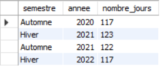

# Manipulation de dates

Les fonctions SQL date, time et datetime permettent de convertir explicitement une chaîne de caractère en DATE, TIME ou DATETIME respectivement (ou convertir les formats de date entre eux). À l'insertion des données, des conversions implicitent s'opèrent.

``` mermaid
erDiagram  
{!etudiants.mermaid!} 
```

```sql
INSERT INTO etudiants (code, nom, annee_admission, 
    date_naissance, programme) VALUES
    (1234567, 'Tony Stark', 2019, date('1970-05-29'), '420.A0'),
    (2345678, 'Steve Rogers' 2019, date('1918-07-04'), '420.A0');
```

## Extraire des informations de la date/temps

On peut avoir besoin d’extraire certains éléments des types DATE, TIME ou DATETIME.

Une fonction existe pour chaque type. La fonction extract permet d’extraire plusieurs informations à la fois.

https://dev.mysql.com/doc/refman/8.0/en/date-and-time-functions.html#function_extract

Exemple : vendredi 2021-02-05 11:04:19

|Fonction|Retourne|Valeur|
||||
|year|l'année|2021|
|month|le numéro du mois|2|
|day / dayofmonth|le numéro du jour dans le mois|5|
|hour|l'heure|11|
|minute|le nombre de minute|4|
|second|le nombre de secondes|19|

Exemple : vendredi 2021-02-05 11:04:19

|Fonction|Retourne|Valeur|
||||
|dayofweek|le numéro du jour de la semaine (0 = dimanche)|5|
|dayname|le nom du jour (anglais)|Friday|
|monthname|le nom du mois (anglais)|February|
|dayofyear|le numéro du jour dans l'année|36|
|weekofyear|le numéro de la semaine dans l'année|5|
|week|le numéro de la semaine|5|

## Date et heure actuelle

On utilise les fonctions suivantes pour obtenir la date et l’heure actuelle.

|Fonction|Type de retour|
|||
|now|DATETIME|
|current_date|DATE|
|current_time|TIME|
|current_timestamp|TIMESTAMP|

## Différences de temps

Pour considérer la différence entre 2 temps (TIME ou DATETIME), on utilise la fonction timediff.

Le résultat de timediff est exprimé en termes de TIME. Si un type DATETIME est utilisé, la partie de la date est ignorée.

Les deux arguments doivent être du même type.

### Exemple de timediff

Par exemple, chaque periode du cours possède un temps de début et de fin et on souhaite connaître la longueur des périodes.

```sql
SELECT periode_id, heure_debut, heure_fin, 
       timediff(heure_fin, heure_debut) 
    FROM periodes; 
```

|periode_id|heure_debut|heure_fin|timediff(heure_fin, heure_debut)|
|:-:|:-:|:-:|:-:|
|1|09:15:00|11:05:00|01:50:00|
|2|08:15:00|12:05:00|03:50:00|
|3|15:15:00|16:05:00|00:50:00|

``` mermaid
erDiagram  
    periodes {
        int periode_id PK
        time heure_debut
        time heure_fin
    }
```
## Différence de dates

De même façon la fonction datediff permet de calculer la différence entre deux dates.

Le résultat de datediff est exprimé en termes de nombre de jours. Si un type **DATETIME** est utilisé, la partie du temps est ignorée.

Les deux arguments doivent être du même type.

### Exemple de différence de dates

Par exemple, on peut exprimer la longueur d'une session en terme de jours, mais cela n'est pas toujours parlant.

```sql
SELECT semestre, annee, 
    datediff(fin_session, debut_session) AS nombre_jours 
    FROM sessions;
```



## Construire une date à partir d'un nombre de jour

La fonction **from_days** permet de construire la date à partir d'un nombre de jours.

Toutefois, cette fonction ne devrait pas être utilisée si le résultat est hors des limites habituels des dates.

## Différence de DATETIME ?

Il n’y a pas de fonction qui retourne l’addition ou différence de **DATETIME**. La partie de date et du temps doivent être traités séparément.

## Addition de temps

Pour ajouter du temps à un type **TIME** on utilise la fonction addtime.

Cette fonction ajoute deux types time ensemble.

```mysql
addtime ('00:02:15', '00:03:18') 
-- retourne 0 h 5 m 33 s
```

## Addition de date

La fonction adddate ajoute un intervalle à un type DATE ou à un type DATETIME. On inscrit un intervalle avec la syntaxe suivante.

```sql
INTERVAL nombre UNITE
```

Les unités possibles sont YEAR, MONTH, WEEK, DAY, HOUR, MINUTE, SECOND 
https://dev.mysql.com/doc/refman/8.0/en/expressions.html#temporal-intervals

Pour ajouter une journée à la date du 15 janvier 2022.

```sql
adddate ('2022-01-15', INTERVAL 1 DAY) 
-- retourne 2022-01-16
```

## Soustraction de date

Pour soustraire un intervalle à un type DATE ou DATETIME, on peut utiliser la fonction subdate.

Cette fonction s’utilise exactement comme adddate.

### :material-cog: --- Exercice 2.4.1 ---

On veut le titre des documents qui :  
A. ont été remis au mois de mai  
B. ont été remis dans les deux dernières années  

On veut le semestre et l'année des sessions qui :  
C. Durent plus de 17 semaines  

## Manipulation de timestamp

Deux fonctions permettent la manipulation des timestamps:

- timestampadd
- timestampdiff

Les fonctions addition ou soustraient 2 timestamp et retournent la valeur sous forme de l’unité indiquée.

Obtenir l’addition de 3 minutes à l’heure actuelle :

```mysql
timestampadd (MINUTE, 3, current_timestamp())
```

Obtenir le nombre de jours avant Noël.

```mysql
timestampdiff (DAY, '2022-12-25', current_timestamp ())
```

## Gestion des fuseaux horaires

MySQL offre plusieurs fonctions pour gérer des informations de différents fuseaux horaires.

Toutes les fonctions de manipulation du temps sont décrites ici:

https://dev.mysql.com/doc/refman/8.0/en/date-and-time-functions.html

## Curiosité de date

Il y a longtemps, le calendrier Julien (de Jules César) a été introduit avec une semaine  jours et des cycles annuels basés sur le Soleil. Malheureusement, avec l'exactitude des méthodes de mesure de l'époque, l'année julienne devait être corrigée.

En 1582, le monde occidental a passé au calendrier Grégorien (demande du pape Grégoire XIII). qui régularise les années et les durées des jours en introduisant les années bisextiles (sur un cycle de 400 ans).

Par contre, le passage a demandé un ajustement particulier...

## Correction d'octobre 1582

Voici le calendrier du mois d'octobre 1582. Les 10 jours supprimés sont entre autre les 9 années bissextile en trop entre le sixième et le seizième siècle (500, 600, 700, 900, 1000, 1100, 1300, 1400 et 1500). 


## Calendrier Grégorien proleptique

Un tel calendrier est un calendrier Grégorien rétropoler à partir d'aujourd'hui. Les dates retirées dans la correction sont inclues dans le calendrier Grégorien proleptique. 

Il s'agit de ce calendrier que MySQL utilise, donc les dates retirées sont valides (exemple 8 octobre 1582), même si elles n'ont jamais réellement existées. 