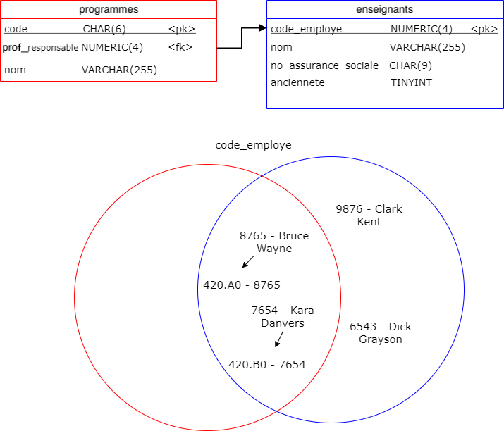
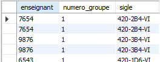
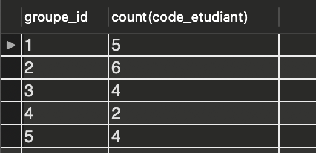
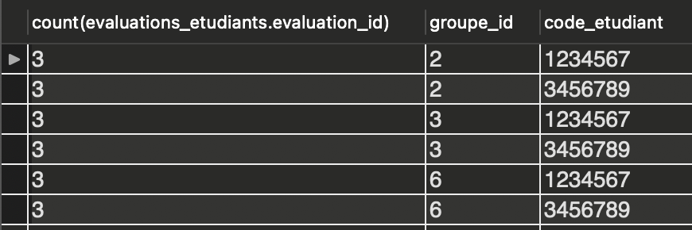
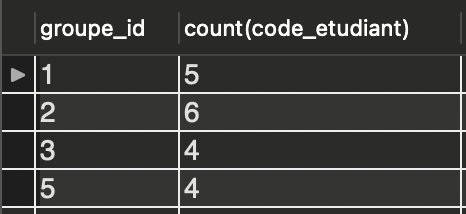

# Jointures et agrégats

- Jointures internes  
- Jointures naturelles  
- Atelier  
- Agrégats de données  
- Atelier  

## Problème 

Pour chaque programme, on veut afficher le nom du programme et le nom de la personne responsable. On aurait un résultat du format suivant

|Nom programme|Nom responsable|
|||
|Informatique appliquée|Bruce Wayne|
|Informatique - Jeux Vidéo|Kara Danvers|

Le problème : nom programme et nom professeur sont dans deux tables différentes.

## Relation Programme - Enseignant

```mermaid  
erDiagram  
    enseignants ||--o{ programmes : " " 
    {!enseignants.mermaid!}
    {!programmes.mermaid!}
```

## Jointures

Une jointure permet de « joindre » deux tables ensemble pour en créer une seule. Ici la table résultant n'est pas une « vraie » table au sens où elle n'est pas enregistrée dans la base de données.

Il existe 3 types de jointures :  
- Jointures internes et naturelles (vues en BD1)  
- Jointures à gauche et à droite (vues en BD2)  
- Jointures externes ou complètes (vues en BD2)  

### Jointures internes

Une jointure interne permet de récupérer les informations en croisant les informations de plusieurs tables. 

On peut voir la jointure interne comme une intersection d'ensembles basé sur l'égalité d'une paire de colonnes.



#### Syntaxe des jointures internes

```mysql
SELECT * FROM Nom_table_1 INNER JOIN Nom_table_2 
    ON Nom_table_1.colonne_1 = Nom_table_2.colonne_2;
```

Donc dans l'exemple précédent

```mysql
SELECT programmes.nom, enseignants.nom FROM enseignants INNER JOIN programmes
    ON enseignants.code_employe = programmes.prof_responsable;
```

On préfixe les colonnes des noms de table pour éviter les ambiguité de nom.

#### Allègement de l'écriture

Lorsqu'il n'y a pas de risque d'ambiguité de nom, on peut omettre le nom des tables comme préfixe. On peut aussi utiliser les alias pour clarifier le nom des colonnes.

```mysql
SELECT programmes.nom AS 'Nom programme', enseignants.nom AS 'Responsable' 
    FROM enseignants INNER JOIN programmes
    ON code_employe = prof_responsable;
```


#### :material-cog: --- Exercice 2.5.1 ---

A. Sélectionnez le nom de chaque étudiant et le nom du programme dans lequel il est inscrit. Triez les résultats par programme.

B. Pour chaque document de la table **evaluations_etudiants**, sélectionnez le nom du document et le code de l'étudiant qui l'a remis.

### Jointure naturelle

Une jointure naturelle est comme une jointure interne. Elle est plus simple à écrire mais nécessite obligatoirement que les colonnes à faire correspondre **portent exactement le même nom**.

ATTENTION : si plus d'une paire de colonne portent le même nom, alors la jointure naturelle vérifira que les deux paires concordent.

Syntaxe de la jointure naturelle :

```sql
SELECT * FROM Nom_table_1 NATURAL JOIN Nom_table_2;
```

On veut afficher le code d'employé et le sigle du cours pour chaque groupe. 

```sql
SELECT enseignant, numero_groupe, sigle 
    FROM groupes NATURAL JOIN cours;
```



``` mermaid

erDiagram  
    cours ||--o{ groupes : " " 
    {!cours.mermaid!}
    {!groupes.mermaid!}
```

### :material-cog: --- Exercice 2.5.2 ---

A. Sélectionnez le titre des évaluations pour lequel aucun document n'est associé.  

B. Sélectionnez l'année admission et le nom de l'étudiant pour chaque étudiant des programmes sous la responsabilité de l'enseignant portant le code 7654.  

## Problème

On veut afficher pour chaque étudiant son nom, le titre des documents qu'il a remis et la date à laquelle la remise s'est faite.

Quelle requête écrire ?

### Jointures multiples

On peut appliquer une jointure sur le résultat d'une jointure.

```mysql
SELECT cours.nom as 'Cours', evaluations.nom_evaluation as 'Titre évaluation' FROM cours 
    INNER JOIN groupes ON cours.cours_id = groupes.cours_id 
    INNER JOIN evaluations ON groupes.groupe_id = evaluations.groupe_id;
```


*44 lignes ont été sélectionnées.*

### :material-cog: --- Exercice 2.5.3 ---

A. Sélectionnez pour le cours de Programmation 2 le nom de tous les documents remis par les étudiants.

B. Trouvez la première année durant laquelle le cours portant le sigle 420-1B2-VI s'est donné.  

## Agrégats

Il est possible d’agréger des données ensemble. Un agrégat consiste à regrouper les données qui partagent une valeur commune pour une colonne précise. On fait un agrégat avec une clause **GROUP BY**.

On utilise généralement une fonction d'agrégation avec un agrégat pour obtenir des informations sur le groupe.

Il faut faire attention dans la sélection des colonnes pour n'afficher que des colonnes qui ont la même valeur pour tout le groupe.

## Exemple 

Sélectionner le nombre d'étudiant dans chaque groupe.

```mysql
SELECT groupe_id, count(code_etudiant) FROM inscriptions
    GROUP BY groupe_id;
```




### :material-cog: --- Exercice 2.5.4 ---

A. Comptez le nombre d'évaluations pour chaque groupe. Affichez seulement l'id du groupe et le nombre d'évaluations.

B. Comptez le nombre de groupes pour chaque session. Affichez le nombre de groupe, la saison et le code de chaque session.

### Agrégats multiples

Il est possible de former les agrégats par plusieurs critères. Par exemple, on souhaite obtenir le nombre de document remis pour chaque étudiant par groupe.

```mysql
SELECT count(evaluations_etudiants.evaluation_id), groupe_id, code_etudiant  FROM evaluations_etudiants 
    INNER JOIN evaluations ON evaluations_etudiants.evaluation_id = evaluations.evaluation_id
    GROUP BY groupe_id, code_etudiant;
```



### :material-cog: --- Exercice 2.5.5 ---

Sélectionnez pour chaque cours le nombre de fois qu'il s'est donné à chaque session (nombre de groupes). Affichez le semestre, l'année de la session ainsi que le sigle du cours. Triez les résultats par sigle.

### Condition sur les groupes

Il est possible de mettre une condition sur un groupe. Une telle condition va dans une clause **HAVING**.

DINSTINCTION IMPORTANTE :

- Une condition portant sur chaque enregistrement 
(avant agrégation) : **WHERE**

- Une condition portant sur un agrégat de données 
(avec une fonction d'agrégation) : **HAVING**

### Exemple

On veut les groupes de 3 étudiants et plus :

```mysql
SELECT groupe_id, count(code_etudiant) FROM inscriptions
    GROUP BY groupe_id
    HAVING count(code_etudiant) >= 3;
```



### Exemple : Alias

On peut utiliser les alias pour éviter de réécrire plusieurs fois le résultat d'une même fonction.

```mysql
SELECT groupe_id, count(code_etudiant) AS nombre_etudiants FROM inscriptions
    GROUP BY groupe
    HAVING nombre_etudiants >= 3;
```

!!! note 
    le nom nombre_etudiants est inscrit tel quel sans guillemet, c'est pourquoi il est accessible. Avec des guillemets, cela aurait changé l'affichage, mais nous n'aurions pas pu l'utiliser dans la clause **HAVING**.

## :material-cog: --- Exercice 2.5.6 ---

A. Sélectionnez le nombre de cours pour chaque session (session_code seulement) où il ne se donne pas plus de 2 cours;

B. Sélectionnez le nombre d'étudiants admis par année après 2019.

## Sélection unique

Dans certains cas, en combinant les jointures avec les agrégats, on peut dupliquer des résultats.

Pour s'assurer que les résultats ne sont pas dupliquer, on doit utiliser le mot-clé **DISTINCT**. On peut utiliser le mot-clé de deux façons

```mysql
-- Dans une requête SELECT pour avoir que les valeurs différentes
SELECT DISTICT colonne

-- Dans la fonction count pour compter le nombre de valeurs distinctes
count(DISTINCT colonne)
```

## :material-cog: --- Exercice 2.5.7 ---

Sélectionnez les sigles des cours ayant plus de 2 évaluations lorsqu'ils se sont donnés. Chaque sigle doit apparaître qu'une seule fois.