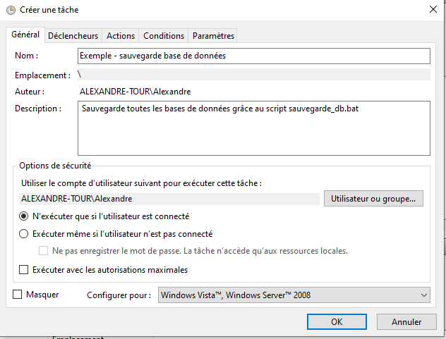

# Automatisation des sauvegardes

## Script bat

Le script bat permet de programmer un script s’exécutant dans l’invite de commande. C’est à peu près l’équivalent Windows des scripts bash des environnements UNIX.

### Sauvegarder la base de données

**Contenu du fichier .bat**:

:: declaration variable
SET "date=%DATE:/=-%"

:: instructions
ECHO ================
ECHO Sauvegarde auto
ECHO ================
I:\Programmes\Ampps\mysql\bin\mysqldump.exe --all-databases > C:\Users\Alexandre\Desktop\backup_%date%.sql -uroot -pmysql
ECHO Sauvegarde realisee avec succes

### Appeler le script

Maintenant, plus qu’à double cliquer sur le script bat pour qu’il s’exécute.

## Programmer la tâche

Avec le planificateur de tâche Windows (Task Scheduler), vous pouvez indiquer à Windows de démarrer une tâche à un moment donné.

Une tâche peut consister à exécuter un script bat par exemple.

Le planificateur se trouve dans « Outils d’administration Windows » 

